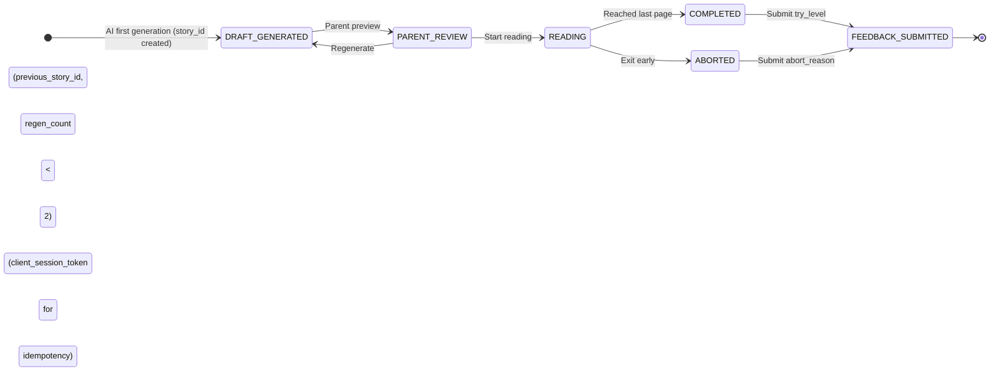
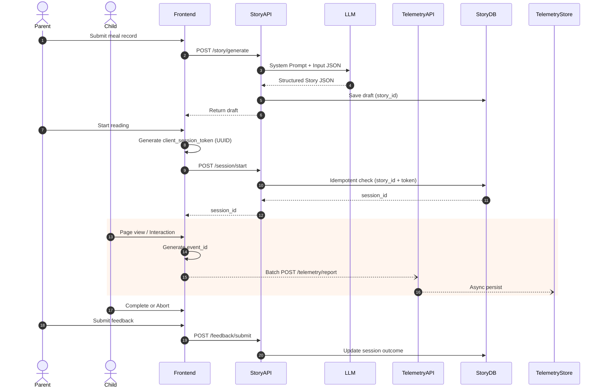

# Story System Architecture v1.0 (Production Spec)

_Last updated: 2026-02-27 06:39 UTC_

This document defines the production-ready system architecture for the AI-driven interactive storybook platform.

---

# 1. Story Session State Machine

## State Definitions

| State | Description |
|-------|------------|
| DRAFT_GENERATED | Story JSON generated and stored |
| PARENT_REVIEW | Parent preview + trust calibration display |
| READING | Active session created and telemetry started |
| COMPLETED | Child finished last page |
| ABORTED | Reading exited early |
| FEEDBACK_SUBMITTED | Parent submitted outcome feedback |

---

# 2. Core Sequence Diagram (Read/Write Separation)

Architecture uses:

- StoryDB (OLTP): strong consistency for stories, sessions, feedback
- TelemetryStore (Events): high-throughput event ingestion

---

# 3. Field Authority Table

| Field | Authority | Purpose |
|-------|-----------|---------|
| story_id | Backend (StoryDB) | Unique story identifier |
| previous_story_id | Client → Backend | Defines regenerate base version |
| regen_count | Backend | Max 2 regenerate limit |
| client_session_token | Frontend UUID | Idempotency key |
| session_id | Backend | Links one reading session |
| event_id | Frontend UUID | Telemetry deduplication |
| page_id | LLM | Stable page identity (p01, p02…) |
| behavior_anchor | LLM | Lv1 / Lv2 / Lv3 intervention level |
| global_visual_style | Backend | Locks Japanese illustration style |
| schema_version | Backend | Version control |

---

# 4. Hard Constraints

1. session/start must be idempotent on (story_id + client_session_token)
2. telemetry/report must deduplicate by event_id
3. regen_count max = 2
4. behavior_anchor ∈ {Lv1, Lv2, Lv3}
5. page_id regex: ^p\d{2,3}$
6. COMPLETED requires try_level
7. ABORTED requires abort_reason

---

# 5. Architecture Goals

- Prevent infinite regeneration
- Ensure weak-network consistency
- Support high-throughput telemetry
- Enable trust calibration display
- Enable aborted-session research analysis
- Provide publishable CHI/CSCW-grade system design
